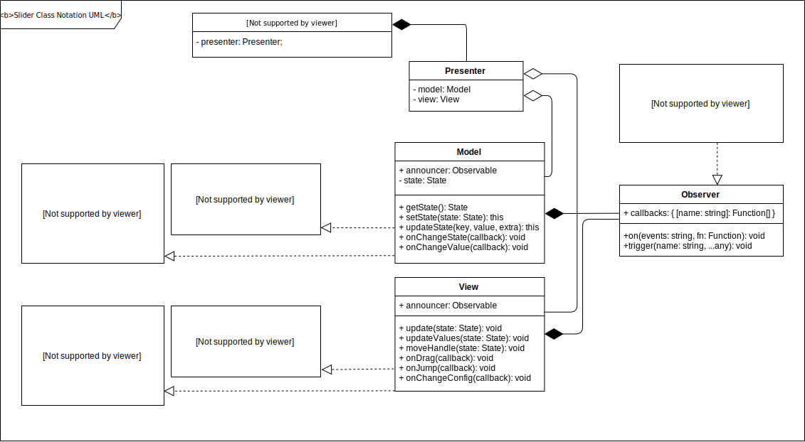
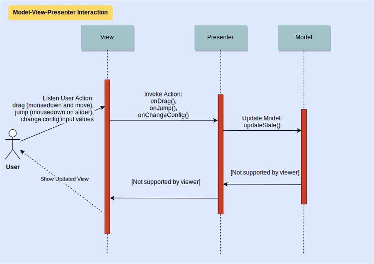

[](https://travis-ci.com/andreylarionovdev/range-slider)
# jQuery range slider plugin
This repository contains a simple range slider app that implements MVP architecture, written in TypeScript and can be used as jQuery plugin.

## Getting Started
Compiled .js and .css files contains in `docs` folder. Make sure, you include `jQuery` and compiled files in your html page to make plugin working on page. Something like bellow:
```$xslt
<html>
  <head>
    ...
    <link href="jquery.range.css" rel="stylesheet"></head>
  </head>
  <body>
    ...
    <script type="text/javascript" src="jquery.min.js"></script>
    <script type="text/javascript" src="jquery.range.js"></script>
  </body>
</html>
```
### Usage
Call the `.range()` function on any range input in jQuery to make element range slider instance.
```$xslt
$('input[type="range"]').range();
```
### Setup with params
It is possible to set variety of parameters to every range slider instance
```$xslt
$('input[type="range"]').range({
  min: 5000,
  max: 15000,
  value: 5500,
  value2: 10000,
  range: true,
  showGrid: true,
});
```
### Setup with data-* attributes
You can also modify every param using data-* attributes. If a boolean parameter specified, then it has true value.
```$xslt
<input type="range"
  data-min="5000"
  data-max="15000"
  data-value="5500"
  data-value2="10000"
  data-range
  data-show-grid
/>
```
Then just call `range()` without arguments.
### Public methods
```$xslt
// 1. Initialise range slider instance
$('input[type="range"]').range();

// 2. Save instance with public api methods to variable
const slider = $('input[type="range"]').data('api');

// 3. Update range slider content (this will change handles positions)
slider.update({
  value: 10,
  value2: 20,
  range: true,
});
```
### Using callbacks
There are two callbacks: `onCreate` and `onChange`. Each callback will receive data object with current range slider state.
```$xslt
$('input[type="range"]').range({
  onCreate: (state) => {
    // Called right after range slider instance initialised
    console.log(state.min);
    console.log(state.max);
    console.log(state.value);
  }
  onChange: (state) => {
    // Called every time range slider state is changed. For example, handle position is changed
    console.log(state.value);
    console.log(state.value2);
  }
});
```
### Plugin parameters
|Parameter | Type | Default | Description |
|----------|------|---------|-------------|
| min | number| 0 |Minimal value. |
| max | number| 100| Maximal value. |
| step | number | 1 | Values changing step. |
| value | number | 0 | Current value. Lowest value of range when `range == true`. |
| value2 | number | null | Highest value of range. Equal to `max`value when `range == true`.|
| range | boolean | false| Whether to allow the user to select a range between two values. |
| vertical | boolean | false | Slider has vertical orientation.|
| showBubble | boolean | false | Every handle has bubble displaying current value.|
| showGrid | boolean | false | Show grid of values.|
| gridDensity | number | 1 | Number of grid units. For example, specify 10, if you want to divide range slider grid on 10 units. |
| onCreate | function | null | Callback. Called right after range slider instance initialised. |
| onChange | function | null | Callback. Called every time range slider state is changed. For example, handle position is changed. |

### Project build
Clone repository:
```$xslt
git clone https://github.com/andreylarionovdev/range-slider.git
```
Go to project directory:
```$xslt
cd range-slider
```
Install dependencies:
```$xslt
npm install
```
To build project: 
```$xslt
npm run prod
```
To run dev server with hot reloading: 
```$xslt
npm run dev
```
### Tests
To run tests:
```$xslt
npm test
```

## Architecture description
Модель и представление рассматриваются независимыми друг от друга и взаимодействуют между собой на основании контрактов (интерфейсов) `State` и `SliderViewExtraData`. Экземпляр класса `Observer` в `Model` и `View` представляет собой реализацию паттерна “Observer” и предназначен для коммуникации между моделью и представлением (другими словами, для передачи в параметры метода модели данных из представления и наоборот - метод представления может быть вызван с данными из модели). Методы, при помощи которых происходит коммуникация между слоями приложения, описаны в контрактах `SliderViewObservable` и `SliderModelObservable`, реализованы в классах `Model` и `View` и связываются в `Presenter` с конечным методом из противоположной сущности функцией обратного вызова.

### Model
Здесь хранится состояние приложения (state: State) и реализованы методы для его модификации.

### View
В представлении реализованы методы для отображения состояния приложения в соответствии с контрактом State.

### Presenter
Тут модель и представление связываются, ждут друг от друга сообщений и реагируют на них вызовом соответствующего метода.

### UML diagrams
#### Class Notation Diagram:


#### Layers Interaction  Diagram:


## Built With

* [TypeScript](https://www.typescriptlang.org/) - JavaScript that scales.
* [jQuery](https://jquery.com/) - The Write Less, Do More, JavaScript Library.
